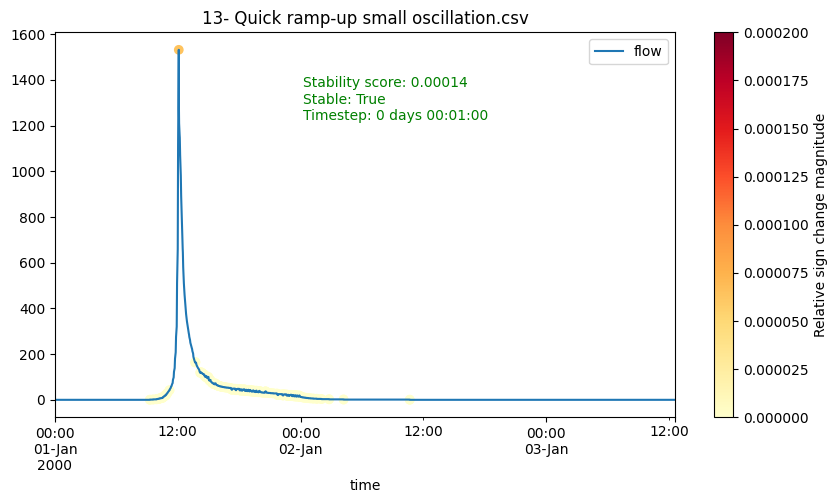
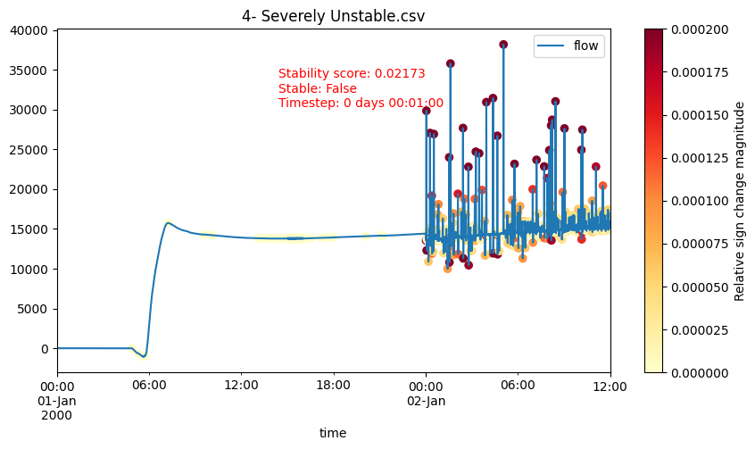

# hydrostab
A Python package for analyzing the numerical stability of hydrograph time series data.
Intended to be used with hydrographs from hydrodynamic models, such as
[HEC-RAS](https://www.hec.usace.army.mil/software/hec-ras/).




More examples: [notebooks/stability-examples.ipynb](notebooks/stability-examples.ipynb)

## Installation

To install from PyPI:
```
pip install hydrostab
```

## Methods

### Slope Change Aggregation
The default and recommended method for stability analysis. This method:
1. Normalizes the hydrograph to a 0-1 range
2. Computes differences between consecutive points (assumes constant timestep)
3. Detects sign changes in the differences (slope reversals)
4. Sums the magnitude of these sign changes
5. Normalizes by the length of the hydrograph

This produces a score between 0 and 1, where:
- 0.0 indicates perfect stability (no oscillations)
- Higher values indicate more instability
- Default threshold of 0.002 classifies hydrographs as stable/unstable

### Experimental Methods
The following methods are experimental and not recommended for typical production use:

- Abrupt Change Detection: Identifies sudden changes in flow values
- Normalized First Derivative: Analyzes rate of change patterns
- FFT Analysis: Uses Fast Fourier Transforms to identify high-frequency oscillations

## Developer Setup
Create a virtual environment in the project directory:
```
$ python -m venv venv-hydrostab
```

Activate the virtual environment:
```
$ source ./venv-hydrostab/bin/activate
(venv-hydrostab) $
```

Install the package in editable mode:
```
(venv-hydrostab) $ pip install -e .
```

Install dev dependencies:
```
(venv-hydrostab) $ pip install ".[dev]"

```

Install dependencies for notebooks (note that we're using 
[jupytext](https://jupytext.readthedocs.io/en/latest/) 
to sync notebooks as Markdown documents):
```
(venv-hydrostab) $ pip install ".[nb]"
```

Install git hook scripts (used for automatic liniting/formatting)
```
(venv-hydrostab) $ pre-commit install
```

With the virtual environment activated, run the tests:
```
(venv-hydrostab) $ pytest
```

## Included Methods
* Slope Change Aggregation (default/recommended)
* Abrupt Change Detection
* Normalized First Derivative 

## Usage
### Single Hydrograph
```python
import hydrostab
import pandas as pd

# Load your hydrograph data
df = pd.read_csv("hydrograph.csv")
flow = df["flow"]

# Basic stability check
is_stable = hydrostab.is_stable(flow)

# Get both stability classification and score
is_stable, score = hydrostab.stability(flow)

# Adjust thresholds if needed
is_stable = hydrostab.is_stable(flow, unstable_threshold=0.003, range_threshold=0.2)
```

### HEC-RAS Model Analysis
A couple methods leveraging [rashdf](https://github.com/fema-ffrd/rashdf) are included to assist with analyzing stability of HEC-RAS model outputs.
This requires installation of the `rashdf` library -- either run `pip install rashdf` after installing `hydrostab`, or:

```
pip install hydrostab[ras]
```

#### Reference Lines Hydrograph Stability
```python
>>> from hydrostab.ras import reflines_stability, mesh_cells_stability
>>> from rashdf import RasPlanHdf
>>> plan = RasPlanHdf("model.p01.hdf")
>>> print(plan)
OUTPUT HERE
>>> stab_reflines = reflines_stability(plan)
>>> print(stab_reflines)
OUTPUT HERE
```

#### 2D Mesh Cells Hydrograph Stability
```python
>>> stab_mesh_cells = mesh_cells_stability(plan, "MESH NAME")
>>> print(stab_mesh_cells)
OUTPUT HERE
```
